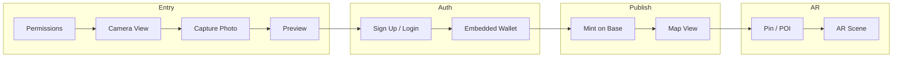

# Memory Archive Mobile Webapp – Implementation Plan

**Goal:** Build a mobile webapp where users sign in (Privy), take a photo with location, mint it as an NFT on Base with metadata (geo, EXIF, date, author, time), see it as a pin on a Mapbox map, and open a geo-anchored AR scene to view the photo at the capture location.

**Architecture:** Single-page React app (Vite + TypeScript). Privy handles auth and embedded Ethereum wallets (Base). Watermarked images and NFT metadata are stored via an external URI (options: client-side IPFS, or backend that pins to IPFS). A Solidity ERC-721 contract on Base mints tokens with `tokenURI` pointing to that metadata. Mapbox GL JS shows a custom map and markers; clicking a marker opens an AR route that uses WebXR + Three.js with GPS/compass to place a textured plane at the photo's real-world coordinates.

**Tech stack:** React 18, Vite, TypeScript, Privy (`@privy-io/react-auth`), wagmi/viem (Base), Mapbox GL JS, Three.js + WebXR, Solidity 0.8.24 + Hardhat (Base), EXIF reading (e.g. `exifr`), canvas-based watermarking.

---

## 1. High-level user flow

- **Permissions:** One screen asking for location and camera; only then proceed.
- **Camera:** Full-screen, branded camera with a single capture button (no gallery/camera switch in MVP).
- **Capture → Preview:** Show captured image; "Save" or "Publish" leads to auth if not logged in.
- **Auth:** Privy modal; sign up / login; embedded wallet created automatically (`createOnLogin: 'users-without-wallets'`); stable user UID from Privy.
- **Publish:** Watermark image → upload image + build metadata JSON → upload metadata → mint ERC-721 on Base with `tokenURI`; then navigate to map.
- **Map:** Mapbox custom style; pins for each minted memory (from contract events or indexer); tap pin → navigate to AR view for that memory.
- **AR:** WebXR AR session; get device GPS + compass; compute relative position from user to photo's lat/lng; place a Three.js plane with the photo texture at that position (geo-anchored); world-tracked session.

---

## 2. Image and metadata storage (deferred choice)

The contract only stores a **URI** (e.g. `ipfs://...` or `https://...`). The plan does not fix one implementation; implement one of these and keep the rest behind an abstraction.

**Option A – Client-only (no backend)**

- Use **NFT.Storage** or **Pinata** from the browser (API key in env).
- Flow: watermarked blob → upload image → get image URI → build metadata JSON (image, geo, exif, date, author, time) → upload metadata → get metadata URI → pass to `mint(to, metadataURI)`.

**Option B – Backend pins to IPFS**

- Small backend (e.g. Next.js API routes or serverless): accepts image + metadata, pins image and JSON to IPFS, returns both URIs.
- Frontend calls backend then mints with returned `metadataURI`.

**Recommendation:** Start with Option A (e.g. NFT.Storage or Pinata) and a small `storage` module (`uploadImage`, `uploadMetadata`) so switching to Option B later is a single adapter change.

---

## 3. App structure and key files

- **Root:** React app with Privy provider and Base chain; one main router (e.g. React Router).
- **Screens (or route components):**
  - `Permissions` – request `navigator.geolocation` and `navigator.mediaDevices.getUserMedia`; store consent/state; CTA to continue.
  - `Camera` – `<video>` + canvas or direct capture; branded frame; one "Capture" button; on capture → navigate to Preview with blob/object URL.
  - `Preview` – show image; "Publish" → if not authenticated, open Privy then retry; if authenticated, run publish flow then go to Map.
  - `Map` – Mapbox container; load minted memories (from contract or indexer); custom markers; click marker → navigate to `/ar/:tokenId` (or similar) with tokenId and metadata (image URL, lat, lng).
  - `AR` – Full-screen WebXR AR; Three.js scene; load photo texture; get user lat/lng + heading; compute offset to photo lat/lng; place plane in world; "Back" to map.
- **Auth:** Wrap app in `PrivyProvider` with `embeddedWallets.ethereum.createOnLogin: 'users-without-wallets'` and Base chain; use Privy's `usePrivy`, `useWallets` and wagmi/viem for `mint()`.
- **Contract:** One ERC-721 contract (e.g. `MemoryArchive`): `mint(address to, string memory tokenURI)` (and optionally emit event with indexable fields). Metadata JSON schema: standard `name`, `description`, `image`, plus `attributes` for `latitude`, `longitude`, `captureTime`, `author` (Privy UID or wallet), and any EXIF you want (e.g. as string or nested object).

Suggested directory shape:

- `src/app/` – provider, router, env.
- `src/screens/` – Permissions, Camera, Preview, Map, AR.
- `src/components/` – shared UI (e.g. branded frame, buttons).
- `src/lib/` – `privy.ts`, `contract.ts` (wagmi/viem mint), `storage.ts` (upload image/metadata abstraction), `exif.ts`, `watermark.ts`, `geoAr.ts` (GPS + compass → Three.js position).
- `contracts/` – Solidity ERC-721; `scripts/` for deploy.
- `public/` – logo for watermark, favicon.

---

## 4. Smart contract (Base)

- **Contract:** ERC-721 (e.g. OpenZeppelin) + `mint(address to, string memory tokenURI)`.
- **Metadata:** Off-chain; `tokenURI` points to JSON. JSON includes `image` (watermarked photo), plus attributes for latitude, longitude, captureTime, author, and optional EXIF.
- **Network:** Base mainnet (and Base Sepolia for dev); deploy with Hardhat; set `baseTokenURI` or per-token URI in contract as needed.
- **Frontend:** Use wagmi `useWriteContract` (or viem `writeContract`) with the connected Privy embedded wallet; ensure wallet is on Base and has a small amount of ETH for gas.

---

## 5. Geo-anchored AR (photo at real-world location)

- **Goal:** When user opens AR from a map pin, show the photo on a plane at the **real-world** lat/lng where the photo was taken.
- **Approach:** WebXR doesn't nangle lat/lng directly. Use a **geofencing-style** method:
  1. Get device position (Geolocation API) and heading (DeviceOrientation or compass).
  2. Get photo's lat/lng from NFT metadata.
  3. Compute distance and bearing from user to photo location.
  4. In the WebXR/Three.js world, place a plane at a position and rotation derived from that relative vector (distance + bearing), e.g. in a "local tangent" or "ENU" style frame so the plane appears in the correct direction and approximate distance.
  5. Texture the plane with the photo image; use a simple `PlaneGeometry` + `MeshBasicMaterial` (or `MeshStandardMaterial`) with `map`.
- **Libraries:** Three.js WebXR (e.g. `WebXRManager`), and either custom math for step 3–4 or a small helper (e.g. Mozilla's [webxr-geospatial](https://github.com/MozillaReality/webxr-geospatial) if it fits). 8th Wall (now open source) is an alternative if you prefer its world-tracking and geo APIs.
- **Constraints:** Accuracy depends on GPS and compass; best effort "in the direction of" the memory location. No need for Niantic VPS or pre-scanned wayspots for this flow.

---

## 6. Mapbox map and pins

- **Map:** One Mapbox GL JS map (React: `useRef` + `useEffect` to create/destroy map); custom style via `mapStyle` (e.g. Mapbox Studio or `mapbox://styles/...`).
- **Pins:** For each minted memory with lat/lng, add a marker (DOM or symbol layer). Prefer custom DOM marker with thumbnail or icon; `setLngLat([lng, lat]).addTo(map)`.
- **Data source:** Either index mint events from your contract (tokenId, tokenURI, minter) and resolve metadata to get lat/lng, or maintain a small backend/indexer that stores tokenId → metadata; frontend fetches list and adds markers. For MVP, fetching metadata from `tokenURI` for each token is acceptable if the set is small.

---

## 7. Watermark and EXIF

- **Watermark:** Client-side canvas: draw captured image, then draw logo (from `public/logo.png` or similar) at a fixed corner with optional opacity; export blob for upload. Reuse this blob in the "upload image" step.
- **EXIF:** Use a library like `exifr` to read EXIF from the original photo blob (before or after watermark); include chosen fields (e.g. date, device, orientation) in the metadata JSON attributes. Do not store raw EXIF in contract storage; only in metadata JSON if desired.

---

## 8. Implementation order (suggested)

1. **Scaffold** – Vite + React + TypeScript; env for Privy, Mapbox, Base RPC, contract address, storage API keys.
2. **Auth** – Privy provider, Base chain, embedded wallet creation; Permissions + minimal Camera + Preview with "Publish" that requires login.
3. **Contract** – ERC-721 + `mint(to, tokenURI)`; deploy to Base Sepolia; wire frontend read/write.
4. **Storage adapter** – Implement Option A (e.g. NFT.Storage or Pinata): upload image, upload metadata JSON, return URI.
5. **Capture pipeline** – EXIF extraction, watermark canvas, then call storage then mint; navigate to Map after success.
6. **Map** – Mapbox init, custom style; fetch minted tokens (events or list); resolve metadata; add markers; click → navigate to AR with tokenId + image URL + lat/lng.
7. **AR** – WebXR AR + Three.js; load photo texture; GPS + compass → relative position; place plane; "Back" to map.
8. **Polish** – Error states (no location, mint failure, AR not supported), loading states, and basic responsive layout for mobile.

---

## 9. Environment and secrets

- **Privy:** `PRIVY_APP_ID` (and any Privy config).
- **Mapbox:** `VITE_MAPBOX_ACCESS_TOKEN`.
- **Base:** RPC URL (e.g. `https://mainnet.base.org` or Sepolia); contract address after deploy.
- **Storage (Option A):** e.g. `VITE_NFT_STORAGE_KEY` or `VITE_PINATA_API_KEY` + `VITE_PINATA_SECRET` (or server-side if you switch to Option B).
- **Wallet:** Users need a small amount of Base ETH for mint gas; document or link to a faucet for testnet.

---

## 10. Testing and verification

- **Contract:** Unit tests (Hardhat) for `mint` and `tokenURI`.
- **App:** Manual E2E on a real device (or Chrome mobile emulation): permissions → capture → login → mint → see pin → open AR and confirm plane appears in direction of memory location.
- **AR:** Test on iOS (Safari WebXR) and Android (Chrome) with location and camera permissions granted.
