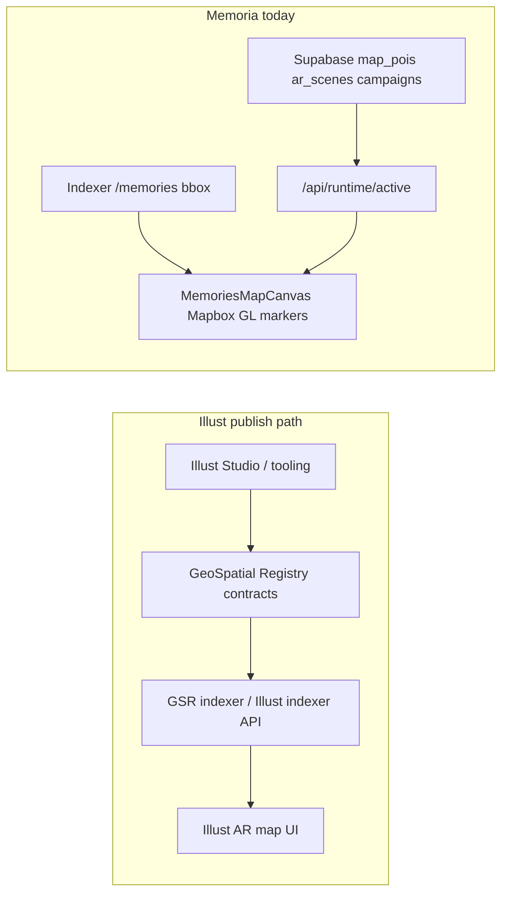

# Illust Studio → Memoria map integration

**Status:** Deferred — build later (optionally in a **fork** of this repo so upstream stays focused while GSR/indexer integration is prototyped).

**Captured:** 2026-04-17

A Cursor-generated variant may also exist under `.cursor/plans/`; treat **this file** as the durable, repo-local spec for forks and future sessions.

---

## Intent

Understand how Illust’s map relates to published “studio” experiences, and bridge that into **memoria.directory** so creators can publish from Illust tooling and see pins on the Memoria Mapbox-based map.

---

## What the Illust GitHub org actually exposes

The org listing ([illustspace repositories](https://github.com/orgs/illustspace/repositories)) only shows **two** public repositories today: **`gsr`** (GeoSpatial Registry) and **`aframe-typescript-class-components`**. There is **no** open-source repo on that org page that implements Illust Studio or Mapbox Studio publish workflows end-to-end.

The **`gsr`** README ([source](https://github.com/illustspace/gsr)) describes the technical pipeline:

- **`@geospatialregistry/contracts`** — GSR smart contracts
- **`@geospatialregistry/sdk`** — TypeScript helpers for placements
- **`@geospatialregistry/indexer`** — indexer service for ownership / placement data off-chain

Illust product docs ([GeoSpatial Registry overview](https://www.illust.space/geospatial-registry/), [Off-Chain Data Usage](https://docs.illust.ar/illust-ar/papers-research-and-thought-leadership/geospatial-registry-litepaper/off-chain-data-usage)) describe **publish → on-chain placement + events → indexers/query APIs → map UI**. This is **not** “Mapbox Studio datasets populate pins”; Mapbox is typically the **basemap/renderer**; locations come from **GSR** (and/or Illust backends).

---

## How Memoria’s map is populated

| Source | Mechanism | Files |
|--------|-----------|--------|
| Memory pins | Indexer `GET /memories` with bbox | [`src/components/MemoriesMapCanvas.tsx`](../../src/components/MemoriesMapCanvas.tsx) |
| POIs / AR / claims | Supabase via [`api/runtime/active.js`](../../api/runtime/active.js), client [`fetchRuntimeActive`](../../src/lib/runtimeActive.ts) | Same map component |

POI taps already support **`open_url`** (payload `url`), **`open_ar_scene`** (iframe URL + optional `sceneId`), and AR scenes as **`iframe_url`** with `scenePayload.url` / `iframeUrl` — Illust-hosted WebAR URLs work **if** stored in Supabase (see `handlePoiTap` / `handleArSceneTap` in [`MemoriesMapCanvas.tsx`](../../src/components/MemoriesMapCanvas.tsx)).

---

## Integration patterns (increasing automation)

### 1) Operational (no code): mirror Illust URLs into Supabase

Use Admin / DB to create **`ar_scenes`** (`scene_type: iframe_url`, `scene_payload: { url: "<illust experience>" }`) or **`map_pois`** with `tap_action: open_url` or `open_ar_scene`. Pins appear when Supabase + time windows are configured.

### 2) Sync job (recommended first engineering step): GSR → Supabase

- Serverless cron or worker that:
  - Queries GSR placements in a bbox (`@geospatialregistry/sdk` + RPC, or Illust public indexer HTTP if available).
  - Normalizes geohash → lat/lng.
  - Resolves **`sceneURI`** to a launch URL.
  - Upserts [`map_pois`](../../supabase/migrations/20250210120000_admin_runtime.sql) / [`ar_scenes`](../../supabase/migrations/20250210120000_admin_runtime.sql) with `starts_at` / `ends_at`.
- Optional: `payload.source = "gsr"`, `externalId` for idempotent sync.

### 3) Client-side GSR layer (no Supabase writes)

Extend [`MemoriesMapCanvas.tsx`](../../src/components/MemoriesMapCanvas.tsx) with a parallel fetch to a thin Memoria API wrapping GSR bbox search. Tradeoffs: client load, CORS, iframe allowlists (`VITE_AR_CLAIM_ORIGINS`).

---

## Open questions (validate with Illust)

1. Does Illust Studio “Publish” always write to GSR, or only for certain assets/chains?
2. Stable HTTP API for bbox queries — base URL, auth?
3. What does **`sceneURI`** resolve to for **`iframe_url`** mode (direct WebAR vs redirect)?

---

## Suggested implementation order

1. Manual proof: one Illust URL as an **`ar_scenes`** row on memoria.directory.
2. Spike GSR read: script or `/api/gsr/placements` using `illustspace/gsr` SDK + env (RPC, contract address).
3. Automate sync to Supabase **or** client overlay once payloads are stable.

---

## Security / product

- Trust only verifiable placements (chain + publisher; optional allowlist).
- Keep **`VITE_AR_CLAIM_ORIGINS`** aligned with AR iframe domains that use `postMessage`.

---

## Checklist (todos)

- [ ] Confirm Illust pipeline: Studio → GSR vs internal; indexer API vs SDK-only
- [ ] Manual POI: one `iframe_url` / `open_url` Illust experience → tap → `/ar`
- [ ] Spike: SDK or indexer → lat/lng + scene URL
- [ ] Decide: Supabase cron vs client overlay; idempotent `externalId` + time windows
